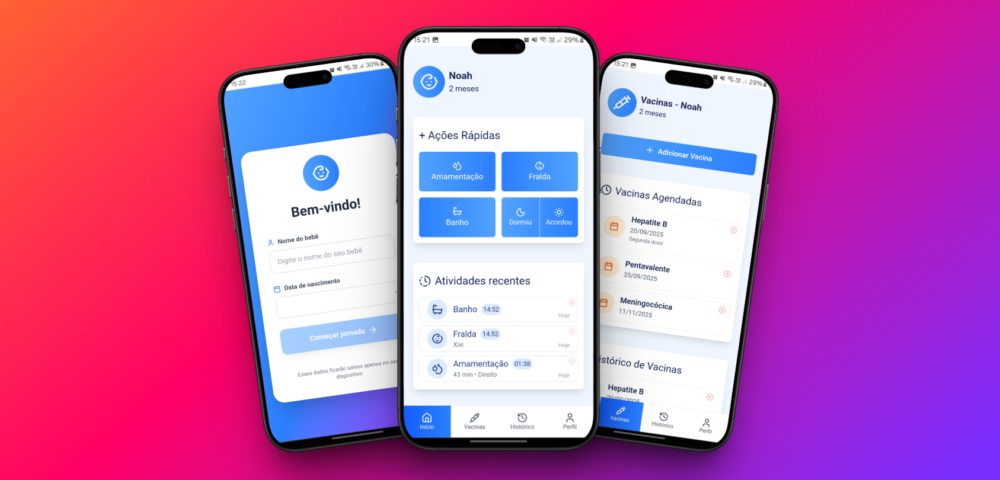

# Descrição

Aplicação PWA desenvolvida com React, pensada para uso principalmente em dispositivos móveis, que permite registrar e acompanhar atividades diárias de um bebê (como amamentação, sono e trocas de fralda). O aplicativo pode ser instalado diretamente no celular, oferecendo uma experiência semelhante a apps nativos. 

https://diario-bebe.vercel.app/